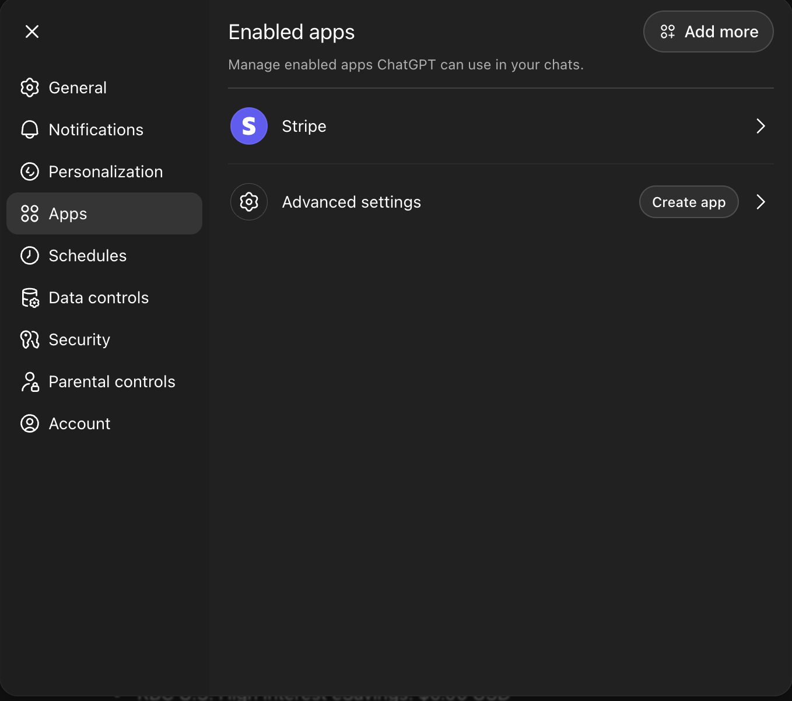
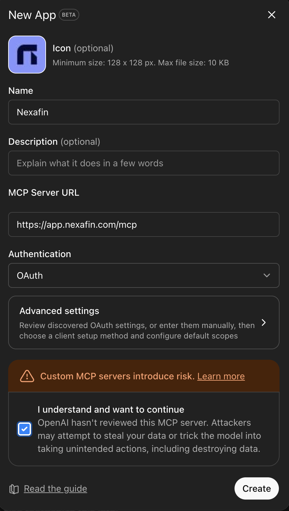
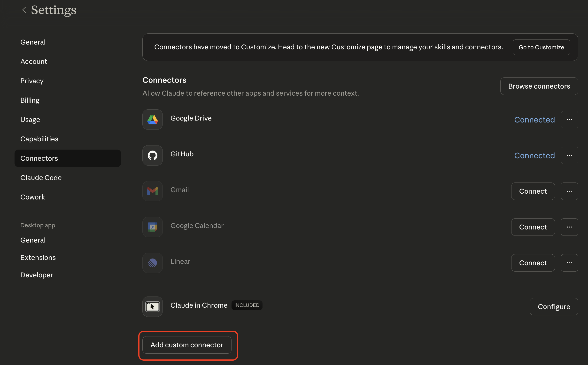
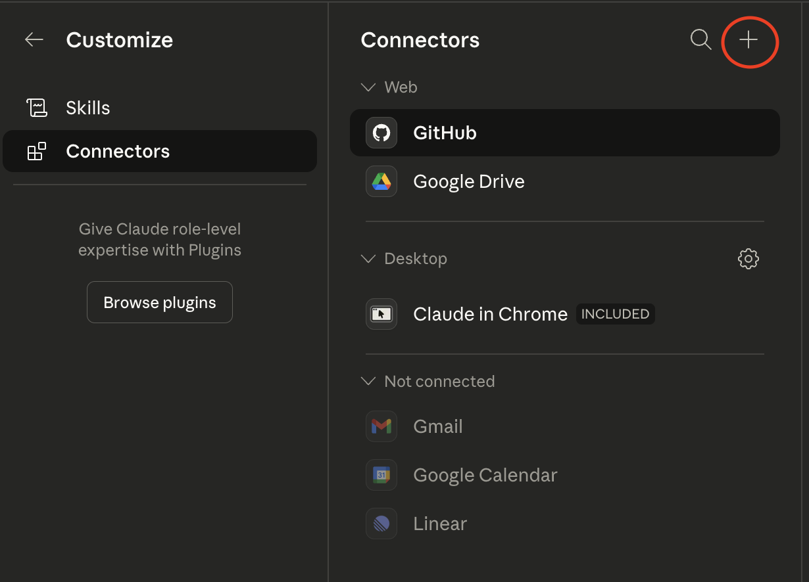
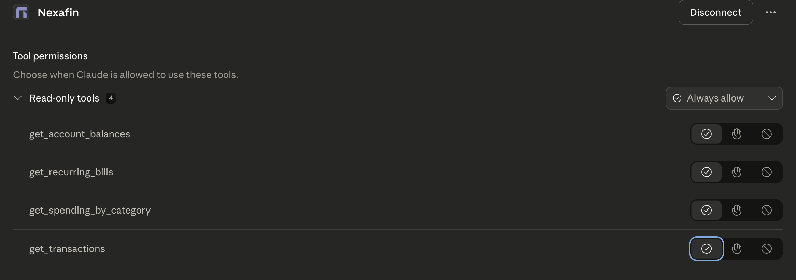

# Quick Start

## ChatGPT

ChatGPT supports MCP servers natively. Add Nexafin as an MCP connection:

1. Open ChatGPT Settings and go to **Apps**

<figure><figcaption></figcaption></figure>

2. Click **Create app**, enter the name (`Nexafin`), the MCP Server URL (`https://app.nexafin.com/mcp`), select **OAuth** for authentication, and check the risk acknowledgment

<figure><figcaption></figcaption></figure>

3. Click **Create** and authorize with your Nexafin account when prompted

## Claude

### Claude Code (CLI)

```bash
claude mcp add --transport http nexafin https://app.nexafin.com/mcp
```

You will be prompted to authorize via OAuth the first time you use a Nexafin tool.

### Claude Desktop

You can connect Nexafin to Claude Desktop using the built-in Connectors UI or by editing the config file.

#### Option A: Connectors UI (recommended)

1. Open Claude Desktop and go to **Settings → Connectors**, then click **Add custom connector**

<figure><figcaption></figcaption></figure>

2. Or from the **Customize** panel, click the **+** button next to Connectors

<figure><figcaption></figcaption></figure>

3. Enter the connector name (`Nexafin`) and URL (`https://app.nexafin.com/mcp`), then click **Add**

<figure><figcaption></figcaption></figure>

4. After connecting, you can manage tool permissions — all 4 tools are read-only

<figure><figcaption></figcaption></figure>

#### Option B: Config file



Edit `~/Library/Application Support/Claude/claude_desktop_config.json`:

```json
{
  "mcpServers": {
    "nexafin": {
      "url": "https://app.nexafin.com/mcp"
    }
  }
}
```



Edit `%APPDATA%\Claude\claude_desktop_config.json`:

```json
{
  "mcpServers": {
    "nexafin": {
      "url": "https://app.nexafin.com/mcp"
    }
  }
}
```



Restart Claude Desktop. You will be prompted to authorize Nexafin via OAuth the first time you use an MCP tool.

## Your first request

Once connected, just ask your AI assistant a question:

> "What are my account balances?"

The assistant will call the `get_account_balances` tool and return your balances in a readable format.

### Example conversation

> **You:** What did I spend on food this month?
>
> **Assistant:** _(calls `get_transactions` with type: "expense", search: "food")_
>
> Let me check your recent food-related expenses...
>
> Here are your food transactions this month:
> - Mar 7: Whole Foods — $85.20
> - Mar 5: DoorDash — $32.50
> - Mar 3: Trader Joe's — $67.80
>
> Total: $185.50 on food this month.


MCP access requires an active PRO subscription. If you see a subscription error, visit [app.nexafin.com](https://app.nexafin.com) to upgrade.

