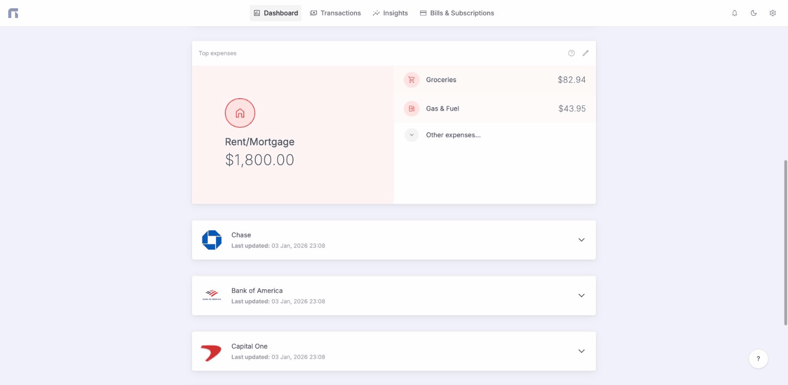

# Bank Accounts

<figure><figcaption></figcaption></figure>

### Endpoints







If you want to receive also the bank information, add `bank` as the value.



```javascript
[
    {
	"id": 1,
	"external_id": "4a2e413e-949e-3804-aa6s-0f2ca6a08bcb",
	"bank_id": 3,
	"bank_connection_id": 1,
	"name": "My Checking Account",
	"type": "checking",
	"subtype": null,
	"currency": "EUR",
	"balance": 4399311,
	"hidden": false,
	"last_transaction_created_at": "2026-03-10T12:00:00.000000Z",
	"last_balance_created_at": "2026-03-10T12:00:00.000000Z",
	"deleted_at": null,
	"created_at": "2022-09-04T16:10:06.000000Z",
	"updated_at": "2022-09-04T16:10:06.000000Z"
    },

    // ...
]
```




**Example request**

```bash
curl -X GET "https://app.nexafin.com/v1/bank-accounts?include=bank" \
  -H "Authorization: Bearer YOUR_API_KEY" \
  -H "Accept: application/json"
```




You can create a new manual account to track your balance and transactions. Unlike connected accounts, manual accounts need to be updated manually.



Bank account name



Currency code: EUR, USD, etc.



Initial balance in cents. Optional.



```javascript
{
    "id": 1
}
```




**Example request**

```bash
curl -X POST https://app.nexafin.com/v1/bank-accounts \
  -H "Authorization: Bearer YOUR_API_KEY" \
  -H "Content-Type: application/json" \
  -H "Accept: application/json" \
  -d '{
    "name": "Cash Savings",
    "currency": "USD",
    "balance": 150000
  }'
```








Bank account ID



New name for bank account



Hide or show the account



Account type (e.g., `checking`, `savings`, `credit`)



Account subtype



```javascript
{
    // Response
}
```





You can only delete manual accounts.



Bank account ID



```javascript
{
    // Response
}
```



```javascript
{
    // Response
}
```


