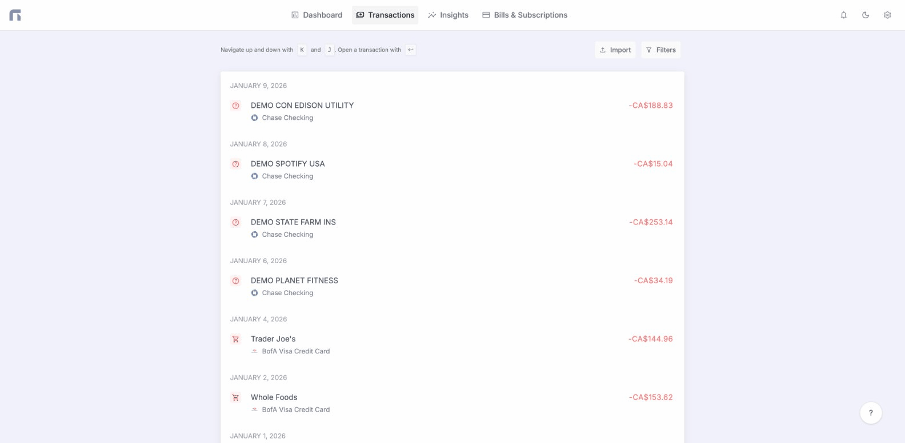

# Transactions

<figure><figcaption></figcaption></figure>


All API requests must include `Accept: application/json` and `Content-Type: application/json` headers. Without the `Accept` header, error responses will return HTML instead of JSON.


### Endpoints



Returns both `booked` and `pending` transactions. Use the `status` field in the response to distinguish between them.



Page number.



Number of items per page.&#x20;

Max value is 30.



You can add one or multiple of category, bankAccount and bankAccount.bank.


Separated by comma.



Filter transactions by description or merchant name.



Filter transactions by bank account ID.



Filter by transaction type: `income` or `expense`.



Filter by category ID.



In which currency do you want the transactions.



Bearer token or API key.


**Example:**&#x20;

Bearer nxfn\_sk\_xxxx...



```javascript
{
  "current_page": 1,
  "data": [
    {
      "id": 1,
      "bank_account_id": 1,
      "category_id": 20,
      "status": "booked",
      "type": "expense",
      "from": [],
      "to": [],
      "description": "Any random description for a transaction",
      "notes": null,
      "amount": -73640,
      "currency": "USD",
      "booked_at": "2022-08-14T00:00:00.000000Z",
      "created_at": "2022-08-14T22:13:58.000000Z",
      "updated_at": "2022-08-14T22:13:58.000000Z",
      "deleted_at": null,
      "category": {
        "id": 20,
        "parent_id": 17,
        "type": "expense",
        "level": 1,
        "accountable": 1,
        "slug": "transportation-expenses-expense",
        "icon": "emoji_transportation",
        "name": "Transportation expenses",
        "description": "All transactions that are recognized as payments for public transportation, taxi, toll roads, department of motor vehicles and car inspections",
        "created_at": "2022-08-14T22:13:56.000000Z",
        "updated_at": "2022-08-14T22:13:56.000000Z"
      },

      // ...
    }
  ],
  "first_page_url": "https://app.nexafin.com/v1/transactions?page=1",
  "from": 1,
  "last_page": 32,
  "last_page_url": "https://app.nexafin.com/v1/transactions?page=32",
  "links": [
    {
      "url": null,
      "label": "&laquo; Previous",
      "active": false
    },
    {
      "url": "https://app.nexafin.com/v1/transactions?page=1",
      "label": "1",
      "active": true
    },

    // ...

    {
      "url": "https://app.nexafin.com/v1/transactions?page=2",
      "label": "Next &raquo;",
      "active": false
    }
  ],
  "next_page_url": "https://app.nexafin.com/v1/transactions?page=2",
  "path": "https://app.nexafin.com/v1/transactions",
  "per_page": 30,
  "prev_page_url": null,
  "to": 1,
  "total": 32
}
```








**Example request**

```bash
curl -X GET "https://app.nexafin.com/v1/transactions?include=category,bankAccount&per-page=10" \
  -H "Authorization: Bearer YOUR_API_KEY" \
  -H "Accept: application/json"
```




You can only create transactions for manual accounts.



In cents. Negative for expenses, positive for income (e.g., -5000 = -$50.00).



The ID of the bank account. Must be a manual account owned by the authenticated user.



Booked at date in Y-m-d format (e.g., `2026-03-16`).



A description of the transaction.



Currency code (e.g., `USD`, `EUR`). Inherited from bank account if not provided.



Optional notes for the transaction.



Category ID. Use `GET /v1/transaction-categories` to list available categories.



```javascript
{
    "id": 9
}
```



```javascript
{
    "message": "The description field is required. (and 3 more errors)",
    "errors": {
        "amount": [
            "The amount field is required."
        ],
        "bank_account_id": [
            "The bank account id field is required."
        ],
        "booked_at": [
            "The booked at field is required."
        ],
        "description": [
            "The description field is required."
        ]
    }
}
```



```javascript
{
    "message": "You can't create a transaction for a non-manual account."
}
```



```javascript
{
    "message": "Unauthenticated."
}
```




**Example request**

```bash
curl -X POST https://app.nexafin.com/v1/transactions \
  -H "Authorization: Bearer YOUR_API_KEY" \
  -H "Content-Type: application/json" \
  -H "Accept: application/json" \
  -d '{
    "amount": -5000,
    "bank_account_id": 1,
    "booked_at": "2026-03-16",
    "description": "Monthly subscription",
    "currency": "USD",
    "notes": "Auto-billed",
    "category_id": 42
  }'
```

**Notes:**
- `amount` is in cents (e.g., -5000 = -$50.00). Negative for expenses, positive for income.
- `bank_account_id` must be a **manual** account you own. Use `GET /v1/bank-accounts` to find your account IDs.
- `booked_at` format: `YYYY-MM-DD`
- `currency` is optional — defaults to the bank account's currency.








Transaction ID



New transaction category



New transaction notes



```javascript
{
    // Response
}
```



```javascript
{
    // Response
}
```





The transaction will be marked as deleted and this action can't be undone.



Transaction ID



```javascript
{
    // Response
}
```



```javascript
{
    // Response
}
```


